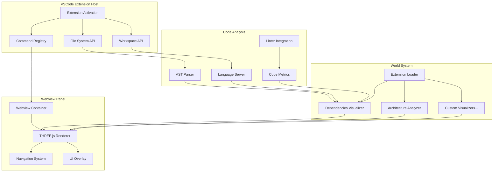

# Design Document: VSCode Extension Integration

## Overview

OpenAs3D will be implemented as a VSCode extension that renders codebase dependencies and architecture as navigable 3D worlds. The extension leverages VSCode's language servers, AST parsing, and workspace APIs to analyze code structure and transform it into spatial representations. Developers can walk through their codebase to understand architecture, identify coupling issues, and spot complexity hotspots.

**Core Philosophy:**
- Transform code dependencies into spatial relationships
- Make architectural patterns visible through 3D clustering
- Leverage spatial memory for code navigation and understanding
- Integrate seamlessly with existing development workflows

## Architecture

### High-Level Components



### Component Responsibilities

**Extension Host (Node.js context):**
- Activate extension on workspace open
- Register commands (Open as 3D, Select Visualizer, etc.)
- Read files from workspace using VSCode FS API
- Manage webview lifecycle
- Handle communication between webview and extension

**Webview Panel (Browser context):**
- Render THREE.js scene
- Handle user input (WASD, mouse)
- Display UI overlays (stats, object details)
- Communicate with extension host via message passing

**Code Analysis (Node.js context):**
- Parse source code using VSCode's language servers
- Extract dependency graphs and import relationships
- Gather code metrics (complexity, coverage, churn)
- Analyze architectural patterns and coupling

**World System:**
- Transform code structure into 3D spatial relationships
- Cluster related modules and highlight dependencies
- Apply visual encoding (color=complexity, size=churn, position=architecture)
- Support filtering and real-time updates

## Components and Interfaces

### 1. Extension Activation

**Entry Point:** `extension.ts`

```typescript
export function activate(context: vscode.ExtensionContext) {
  // Register commands
  // Initialize extension loader
  // Set up file watchers
}
```

**Key Responsibilities:**
- Register command palette commands
- Register context menu items (right-click on files)
- Initialize world loader
- Create webview panel on command invocation

### 2. Webview Panel Manager

**Purpose:** Create and manage the 3D world webview

**Key Operations:**
- Create webview panel with THREE.js content
- Set up message passing between extension and webview
- Handle panel lifecycle (show, hide, dispose)
- Inject world data into webview

**Communication Protocol:**
```typescript
// Extension → Webview
{
  type: 'loadWorld',
  visualizer: 'csv',
  data: { /* file contents */ }
}

// Webview → Extension
{
  type: 'objectSelected',
  objectId: 'file-123',
  metadata: { /* object data */ }
}
```

### 3. THREE.js Renderer (Webview)

**Purpose:** Render 3D scene and handle navigation

**Key Components:**
- Scene setup (camera, lights, ground plane)
- Object management (add, remove, update)
- Navigation system (WASD + mouse)
- Raycasting for object selection

**Renderer API (exposed to visualizers):**
```typescript
interface RendererAPI {
  addObject(id: string, geometry: THREE.Geometry, material: THREE.Material, position: Vector3): void;
  removeObject(id: string): void;
  addGroup(id: string): THREE.Group;
  clear(): void;
  setCameraPosition(x: number, y: number, z: number): void;
}
```

### 4. Extension Loader

**Purpose:** Discover and load world visualizers

**Discovery Process:**
1. Scan `extensions/` directory for visualizer folders
2. Read `manifest.json` from each folder
3. Register visualizers by type (csv, git, custom)
4. Load visualizer module when requested

**Visualizer Interface:**
```typescript
interface WorldVisualizer {
  manifest: {
    name: string;
    type: string;
    filePatterns: string[];
  };
  
  initialize(renderer: RendererAPI, data: any): CleanupFunction;
}

type CleanupFunction = () => void;
```

### 5. Codebase Dependencies Visualizer

**Purpose:** Transform code structure and dependencies into navigable 3D space

**Transformation Logic:**
- Parse codebase using language servers and AST analysis
- Create 3D objects for files, modules, classes, and functions
- Render import/dependency relationships as connecting edges
- Use spatial clustering to group related code
- Apply visual encoding for metrics (complexity, size, churn)

**Spatial Mapping:**
```
File/Module → 3D Box or Sphere
- Complexity → Color (green=simple, red=complex)
- Lines of Code → Height/Size
- Recent Changes → Glow/Outline
- Dependencies → Connecting Lines
- Architecture Clusters → Spatial Proximity
```

**Example Layouts:**
- **Layered Architecture:** Frontend, backend, database layers in 3D space
- **Module Clusters:** Related files grouped spatially
- **Dependency Flow:** Arrows showing import directions
- **Hotspot Highlighting:** Complex/problematic areas stand out visually

### 6. Code Metrics Integration

**Purpose:** Integrate code quality and analysis data into 3D visualization

**Data Sources:**
- VSCode language servers (TypeScript, Python, etc.)
- Linters (ESLint, Pylint, etc.)
- Code coverage tools
- Git history for churn analysis
- Complexity analyzers

**Visual Encoding:**
```
Cyclomatic Complexity → Color Intensity
Test Coverage → Transparency/Outline
Error Count → Warning Particles
Code Churn → Object Animation
Dependency Count → Edge Thickness
```

## Data Models

### Manifest Schema

```json
{
  "name": "Codebase Dependencies Visualizer",
  "type": "codebase",
  "version": "1.0.0",
  "languages": ["typescript", "javascript", "python", "java"],
  "description": "Visualize code dependencies and architecture in 3D"
}
```

### Code Object Metadata

```typescript
interface CodeObjectMetadata {
  id: string;
  type: 'file' | 'module' | 'class' | 'function';
  filePath: string;
  language: string;
  complexity: number;
  linesOfCode: number;
  dependencies: string[];
  dependents: string[];
  lastModified: Date;
  testCoverage?: number;
  errorCount?: number;
}
```

### Dependency Relationship

```typescript
interface DependencyEdge {
  source: string;
  target: string;
  type: 'import' | 'extends' | 'implements' | 'calls';
  strength: number; // frequency or importance
  isCircular?: boolean;
}
```

## Correctness Properties

*A property is a characteristic or behavior that should hold true across all valid executions of a system—essentially, a formal statement about what the system should do. Properties serve as the bridge between human-readable specifications and machine-verifiable correctness guarantees.*

### Property 1: Extension activation and command registration

*For any* VSCode workspace, when the OpenAs3D extension activates, all registered commands should be available in the command palette and context menus should appear in the file explorer.

**Validates: Requirements 1.1, 1.5, 8.1**

### Property 2: Webview scene initialization

*For any* webview panel creation, the THREE.js scene should contain a camera, at least one light, and be ready for object rendering.

**Validates: Requirements 2.1**

### Property 3: Navigation input handling

*For any* sequence of navigation inputs (WASD, mouse, F, Space, C, ESC), the camera position, rotation, and navigation mode should update correctly according to the input type and current mode.

**Validates: Requirements 3.1, 3.2, 3.3, 3.4, 3.5**

### Property 4: Visualizer lifecycle management

*For any* world visualizer, loading should execute the initialization function with correct parameters, and unloading should call the cleanup function and remove all associated objects from the scene.

**Validates: Requirements 4.3, 4.4, 4.5**

### Property 5: Codebase analysis creates objects for all code entities

*For any* valid codebase with N files, the codebase visualizer should create 3D objects for all analyzable code entities (files, modules, classes) and render dependency relationships between them.

**Validates: Requirements 5.1, 5.2, 5.3**

### Property 6: Code metrics integration updates visual properties

*For any* code object with available metrics (complexity, coverage, errors), the visualizer should encode these metrics into visual properties (color, size, transparency) that accurately reflect the metric values.

**Validates: Requirements 6.1, 6.2, 6.3, 6.4**

### Property 7: Dependency analysis and hotspot detection

*For any* codebase with circular dependencies, high coupling, or complex modules, the visualizer should highlight these architectural problems with distinct visual indicators and spatial arrangements.

**Validates: Requirements 7.1, 7.2, 7.3, 7.4, 7.5**

### Property 8: Object interaction and code navigation

*For any* 3D code object, clicking should highlight dependencies, display code metadata, and double-clicking should open the corresponding file in VSCode's editor.

**Validates: Requirements 8.1, 8.2, 8.3, 8.4, 8.5, 8.6**

### Property 9: Real-time code change updates

*For any* code modification in the workspace, if that code is currently visualized, the 3D world should update to reflect the changes without requiring full re-analysis.

**Validates: Requirements 9.3, 9.6**

### Property 10: Performance with large codebases

*For any* codebase with up to 1,000 files, the renderer should maintain 60 FPS, and with up to 5,000 files should maintain 30+ FPS using level-of-detail rendering.

**Validates: Requirements 10.2, 10.3**

## Error Handling

### Extension Activation Errors
- **Missing dependencies:** Show notification, disable extension
- **Command registration failure:** Log error, continue with partial functionality

### File System Errors
- **File not found:** Show notification, skip file
- **Permission denied:** Show notification with instructions
- **Invalid file format:** Show notification, offer to try different visualizer

### Webview Errors
- **THREE.js initialization failure:** Show error panel with fallback message
- **Out of memory:** Implement object culling, show warning
- **WebGL not supported:** Show notification with system requirements

### Visualizer Errors
- **Invalid manifest:** Skip visualizer, log warning
- **Runtime error in visualizer:** Catch error, show notification, unload visualizer
- **Cleanup failure:** Log error, force remove objects

## Testing Strategy

### Unit Tests
- Test command registration
- Test file system operations
- Test CSV parsing logic
- Test Git tree traversal
- Test message passing protocol
- Test visualizer discovery

### Property-Based Tests
- **Property 1:** Generate random command invocations, verify all commands are registered
- **Property 2:** Generate random webview creations, verify scene structure
- **Property 3:** Generate random WASD sequences, verify camera movement
- **Property 4:** Generate random visualizer loads/unloads, verify cleanup
- **Property 5:** Generate random CSV files, verify object count matches row count
- **Property 6:** Generate random object selections, verify file opening
- **Property 7:** Generate random file modifications, verify world updates
- **Property 8:** Generate random object counts (up to 1000), measure FPS
- **Property 9:** Generate random visualizer folders, verify discovery
- **Property 10:** Generate random theme changes, verify UI updates

**Configuration:**
- Use `fast-check` for TypeScript property-based testing
- Run minimum 100 iterations per property test
- Tag each test: `Feature: vscode-extension-integration, Property N: [property text]`

### Integration Tests
- Test full workflow: activate extension → open file → visualize → navigate
- Test VSCode API integration (commands, file system, webview)
- Test visualizer loading and execution
- Test object selection → file opening flow

### Manual Testing
- Test in VSCode with real workspaces
- Test with large CSV files (10k+ rows)
- Test with large Git repositories (1000+ files)
- Test theme switching
- Test on different operating systems (macOS, Windows, Linux)

## Implementation Notes

### VSCode Extension Structure

```
vscode-extension-integration/
├── src/
│   ├── extension.ts          # Extension entry point
│   ├── webview/
│   │   ├── panel.ts          # Webview panel manager
│   │   ├── renderer.html     # Webview HTML template
│   │   └── renderer.ts       # THREE.js renderer (bundled)
│   ├── visualizers/
│   │   ├── loader.ts         # Extension loader
│   │   ├── csv.ts            # CSV visualizer
│   │   └── git.ts            # Git visualizer
│   └── utils/
│       ├── messaging.ts      # Extension ↔ webview communication
│       └── fileSystem.ts     # File system helpers
├── extensions/               # User-installable visualizers
│   ├── csv/
│   │   └── manifest.json
│   └── git/
│       └── manifest.json
├── package.json              # Extension manifest
└── tsconfig.json
```

### Key VSCode APIs

- `vscode.commands.registerCommand()` - Register commands
- `vscode.window.createWebviewPanel()` - Create 3D world panel
- `vscode.workspace.fs` - Read workspace files
- `vscode.window.showTextDocument()` - Open files in editor
- `vscode.workspace.onDidChangeTextDocument()` - Watch file changes
- `vscode.window.registerTreeDataProvider()` - Optional: sidebar tree view

### Webview Security

- Use `Content-Security-Policy` to restrict script sources
- Use `vscode-resource:` scheme for local resources
- Sanitize all data passed from extension to webview
- Use message passing (no direct DOM access from extension)

### Performance Considerations

- Bundle THREE.js with webview (don't load from CDN)
- Use geometry instancing for repeated shapes
- Implement frustum culling for off-screen objects
- Use level-of-detail (LOD) for distant objects
- Lazy-load visualizers (don't load all at activation)

### Distribution

- Package as `.vsix` using `vsce package`
- Publish to VSCode marketplace
- Include README with screenshots and usage instructions
- Include sample workspaces for testing
- Version using semantic versioning (1.0.0)
